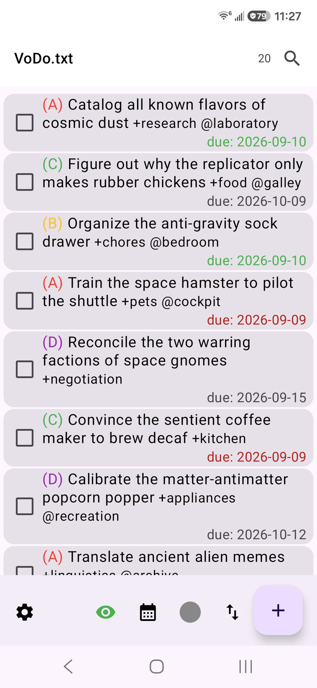
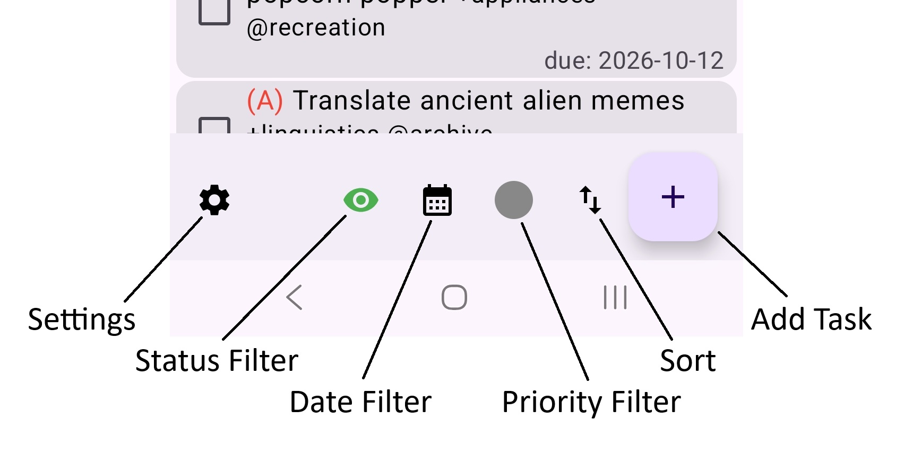
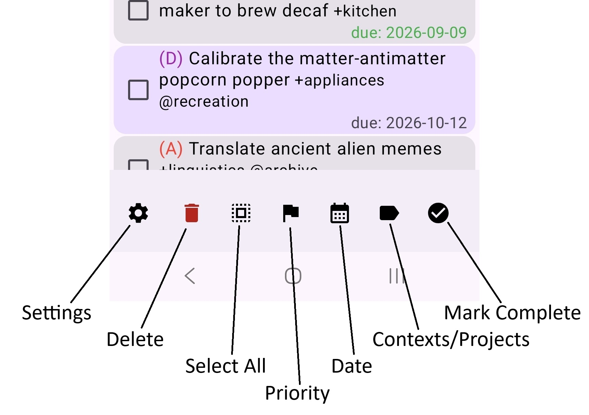

# VoDo.txt (ˈvü-ˌdü ˈdät ˈtekst)

VoDo.txt was born from the end of development of *SimpleTask* and dissatisfaction with the current alternatives. With the exception of [recurrence](https://github.com/fleapower/vodotxt?tab=readme-ov-file#the-vodo-extensions-recurrence--last), VoDo.txt uses the standard [todo.txt](https://github.com/todotxt/todo.txt/blob/master/README.md#todotxt-format-rules) format with a focus on speed.

<kbd></kdb>
---

## Quick Start: Initial Setup
When you first launch VoDo.txt, you'll be greeted by the **Welcome Setup**.

1. **Select Storage Folder**: Click the button to choose a location on your device (e.g., your "Documents" folder).
2. **Automated**: VoDo.txt will automatically create a `vodo.txt/` subfolder and initialize your `todo.txt` and `done.txt` (archive) files.
3. **External Access**: Because these are stored in a standard Android folder, you can open, edit, or sync them with any other app or computer.

---

## Google Drive Sync
- **Enable Sync**: In **Settings**, toggle "Enable Google Drive Sync."
- **Choose a Folder**: Select the folder on your Drive where you want the files to live. You will be asked which version you want to prioritize on the initial sync.
- **Conflict Resolution**: If a task is changed on your phone and Drive simultaneously, VoDo.txt will detect the collision, create a backup in your **Conflicts Folder**.

---

## Managing Tasks

### Adding a Task
Tap the **[+]** button. The **Task Details** dialog will open:
- **Auto-Population**: If you have active filters (like `@work` or `+Project`), the task field is automatically prepopulated with those tags.
- **Smart Formatting**: If you don't remember the format for a particular element of the todo.txt protocol, the app will handle it for you by using the buttons below the Task field.
- **Creation Date**: If enabled in Settings, the current date is added automatically.

#### Natural Language Parsing
When entering or editing a task, you can use natural language to set due dates. Simply type `due:` followed by a keyword, and it will fill in the correctly formatted date:
- `due:today` -> `due:2026-09-08`
- `due:tomorrow` -> `due:2026-09-09`
- `due:monday` (or any day of the week) -> Snaps to the **next** occurrence of that day.

> **Note**: This is a quick-entry feature. The actual file always stores dates in the standard `YYYY-MM-DD` format for compatibility.

### Editing a Task
Simply tap any task in the list to open the Details dialog. You can edit the raw text or use the quick-action icons for Priority, Due Date, Recurrence, Context, and Projects.

### Toggling Task Completion
There are four ways to toggle task completion:
- **Doubletap**: This is configurable in Settings.
- **Checkbox**: This can be hidden in Settings.
- **Swipe Right**: This is configurable in Settings. You can choose to postpone by one day, complete, or do nothing with a right swipe.
- **Select**: Long press and then tap the checkmark in the bottom menu.

### Quick Add Shortcut
Long-press the **VoDo.txt app icon** on your home screen. You can launch a minimalist "Quick Add" popup or place the shortcut directly onto your home screen for one-tap entry.

### Searching
The magnifying glass in the top right allows you to search the current filter set. If you want to search all tasks, you need to clear the filter first.

### Quick Action
Automatically provides shortcuts for **Links**, **Emails**, and **Phone Numbers** found in your tasks.

---

## Interaction & Gestures

<!--  -->

### Main Menu Button Legend (Left to Right)
1. **Settings**: Configure app behavior, themes, and file locations.
2. **Status Filter**: Cycle through showing All tasks, Incomplete only, or Completed only.
3. **Date Filter**: Cycle through All tasks, Today's tasks, or Tomorrow's tasks.
4. **Priority Filter**: Cycle through filtering by specific priorities (A, B, C, D) or clear the filter.
5. **Sort**: Cycle the list order between File Order, Due Date, or Priority.
6. **Add Task**: Add task in Task Details dialog.

---

<!---->

### Selection Mode Button Legend (Left to Right)
*Selection mode is entered by long-pressing a task.*
1. **Settings**: Configure app behavior, themes, and file locations.
2. **Bulk Delete**: Permanently delete all selected tasks.
3. **Select All**: Select all tasks currently visible in the list.
4. **Bulk Priority**: Assign or clear the priority for all selected tasks.
5. **Bulk Change Date**: Set or clear the due date for all selected tasks.
6. **Bulk Contexts/Projects**: Add or remove tags across all selected tasks.
7. **Bulk Toggle Complete**: Mark all selected tasks as complete (or incomplete).

---

- **Swipe Right**: Quickly complete or postpone a task (configurable in Settings).
- **Swipe Left**: Open the **Filter Drawer**.
- **Drag and Drop**: In **File Sort** mode, long-press and hold, then drag to physically reorder your tasks.

---

## Filtering
The **Filter Drawer** (swipe from left) is the engine of VoDo.txt.

- **Ad-hoc Filtering**: Tap any Context (@) or Project (+) to instantly filter your list.
- **Inversion**: Tap the "Invert" checkbox to see everything *except* the selected tags (e.g., "Show me everything that isn't @work").
- **Saving Filters**: Create complex filter combinations and save them with a name.
  - **Draft Logic**: When you click "Create New Filter," the dialog is prepopulated with whatever ad-hoc filters you currently have active.
- **Closing**: Tap the "All Tasks" header or the "x" button next to the filter name while in task list view to clear any filters.
- **Reordering**: Use the handles to reorder saved filters.
- **Deleting**: Long-press a filter name to delete it.

---

## The VoDo Extensions: Recurrence & Last
While VoDo.txt follows the `todo.txt` standard, it adds two tags to handle repeating tasks.

### 1. Recurrence (`r:`)
The rule for recurrence is simple: **Where is the letter?**

| Syntax | Meaning | Usable Letters | Example | Read as... |
| :--- | :--- | :--- | :--- | :--- |
| **Letter First** | On a specific day | W, M | `r:w02` | "Weekly on the 2nd day (Monday)" |
| **Letter Last** | Every X units | D, W, M, Y | `r:03w` | "Recur every 3 weeks" |
| **Annual** | Every year | Y | `r:y0304` | "Every March 4th" |

> **Formatting**: In the recurrence string, the numeric part is always **two digits** (e.g., `01`, `03`, `15`), except when performing a yearly recurrence on a specific date (`Annual`), which requires **four digits** (MMDD format).

> NOTE: Recurrence days do not shift. If you have `r:w02` (Monday) and postpone the task to Tuesday, the *next* occurrence will still correctly fall on a Monday.

### 2. The Last Tag (`last:`)
Whenever a recurring task is completed, VoDo.txt automatically adds a `last:YYYY-MM-DD` tag. This keeps a record of exactly when you last performed that action. This can be disabled in Settings.
> NOTE: After disabling last tags in Settings, existing last tags will be removed as each individual recurring task is completed.

---

## Settings Reference
- **Appearance**: Customize font size, themes (Light/Dark/System), and toggle checkboxes.
- **Gestures**: Choose if a right-swipe completes or postpones a task.
- **Protocol Options**: Toggle "Auto-Creation Date" or choose to "Maintain Last Tag."
- **Archiving**: One-tap to move all completed tasks into your `done.txt` file.
- **Backup/Restore**: Export your entire app configuration (including all saved filters) to a JSON file.

---

[GitHub Repository](https://github.com/fleapower/vodotxt)
